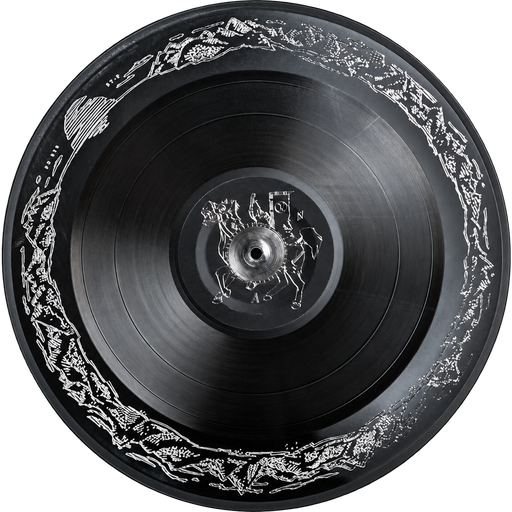
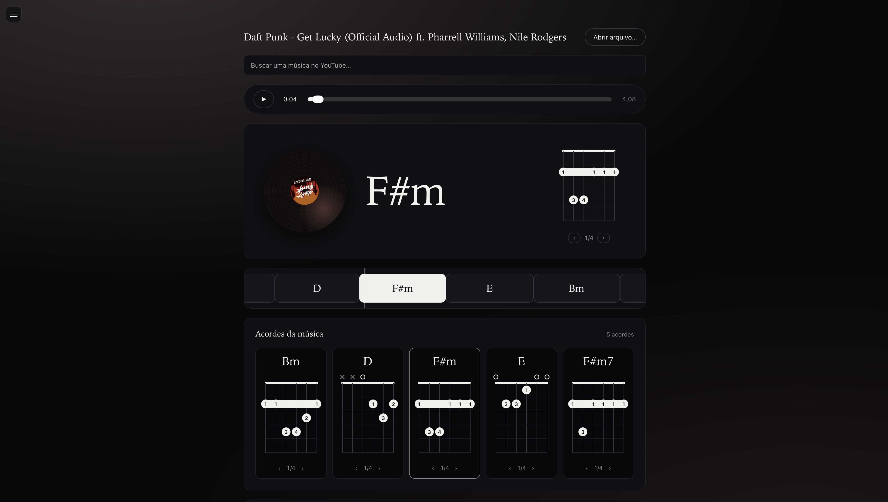
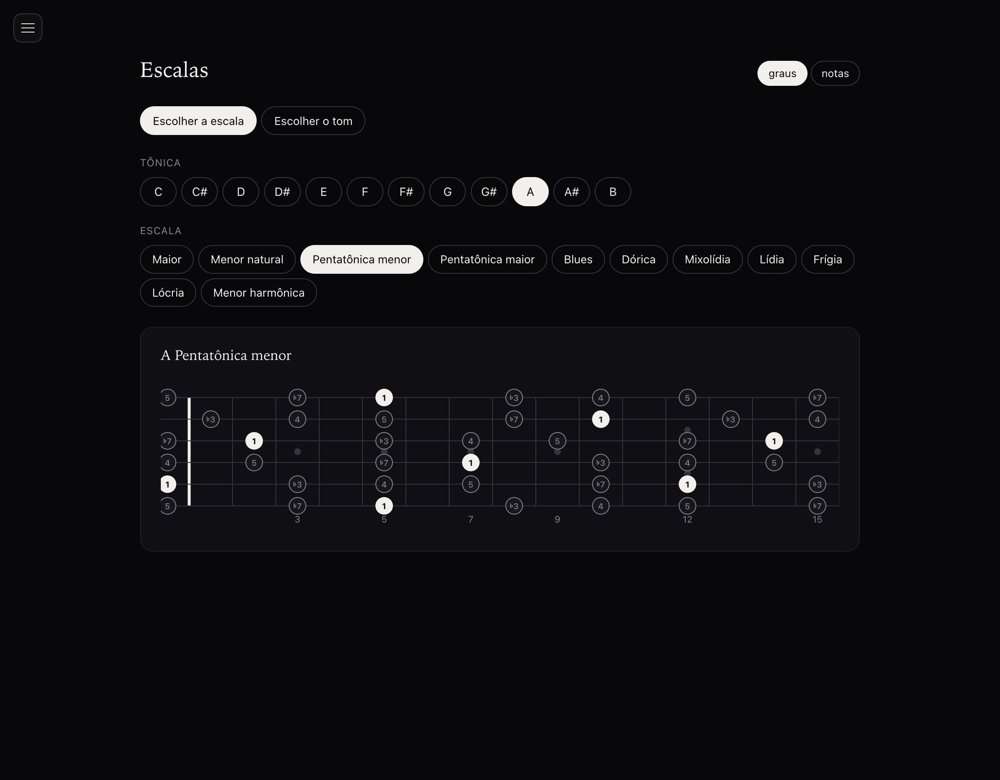
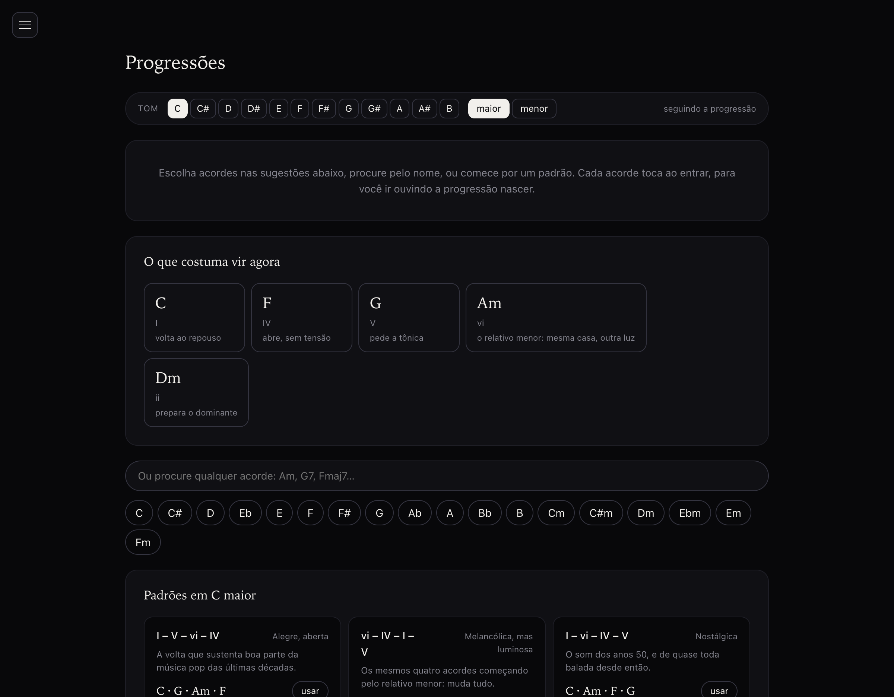

<p align="center">
  
</p>

<h1 align="center">Made in Heaven</h1>

<p align="center">
  A native desktop app that listens to a song and shows you the chords —
  live, on a guitar neck, with nothing sent to a server.
</p>

<p align="center">
  <a href="https://joaovictorbalvedi.github.io/made-in-heaven/"><strong>Landing page »</strong></a>
</p>

<p align="center">
  
  
  
  
  
</p>

Point it at a YouTube link or a local file, and it detects the chords itself —
no tabs, no chart, no internet round-trip. Everything runs on your machine:
a Rust shell owns the window and the analysis pipeline, a short-lived Python
worker does the actual listening, and the result is cached so you only pay
for it once per song.

## What it does

### Play along

Search a song on YouTube or open a file from disk. Chords are detected
locally and run on a timeline synced to the audio, drawn live on a guitar
neck. Everything you open is kept in a repertoire and reopens instantly —
no re-importing, no re-analyzing.



### Scales

Every major scale, mode, pentatonic and blues shape, in any key, across the
whole neck. Pick a scale directly, or pick a key and see everything that fits
over it — the seven modes, both pentatonics, the blues scale — labeled by
scale degree or by note name.



### Progressions

Build a chord sequence and hear each chord as it's added. The app infers the
key from what you've built and suggests what tends to come next, with the
reasoning ("V — pulls toward the tonic"). Twelve well-known progressions —
pop, jazz, blues, the Andalusian cadence, Pachelbel's canon — can be loaded in
any key, and your own progressions save and reload.



## How it's built

```text
Svelte 5 + TypeScript
   │ typed commands
Tauri boundary (Rust)
   ├── native dialogs
   ├── subprocess supervision   (process.rs)
   ├── chord analysis           (analysis.rs)
   └── on-disk cache
        │ bounded JSON, one invocation per song
   Python worker (LV-Chordia + torch)
```

- **Frontend** — Svelte 5 + TypeScript. Pure calculation (which chord is
  sounding, where the playhead sits, time formatting) lives in tested modules
  outside the DOM, so playback sync is testable without opening a window.
- **Shell** — Rust via Tauri 2. Deliberately thin: window, native dialogs,
  subprocess supervision, output validation, disk cache. No business logic
  duplicated from the worker.
- **Analysis** — a short-lived Python process running
  [LV-Chordia](https://github.com/openmirlab/lv-chordia) does chord
  recognition. It is the *only* authority on what chord is sounding; Rust
  validates the shape of its output (timestamps finite and ordered, confidence
  in range, no gaps) and rejects malformed results — it never rewrites or
  smooths a label.
- **Cache** — analysis is expensive the first time (~30s model load, then
  ~30x real time) and deterministic, so results are keyed by the **content**
  hash of the audio, not its path. Renaming or moving a file never forces a
  re-analysis.

Full write-up, including where this diverges on purpose from the project it
was inspired by, in [`docs/ARCHITECTURE.md`](docs/ARCHITECTURE.md)
(Portuguese).

## Built on

- Chord detection by [LV-Chordia](https://github.com/openmirlab/lv-chordia)
- Chord shapes from [chords-db](https://github.com/tombatossals/chords-db)
- Audio import via [yt-dlp](https://github.com/yt-dlp/yt-dlp)
- Desktop shell: [Tauri](https://tauri.app/) + [Svelte](https://svelte.dev/)

Architecture inspired by SonArcan, with deliberate divergences documented in
[`docs/ARCHITECTURE.md`](docs/ARCHITECTURE.md).

## Run it

There's no installer to download: the packaged app only works on the machine
that built it (more on why below), so getting it running means building it
yourself — five commands, no Rust or Python experience required.

```bash
# once
git clone https://github.com/JoaoVictorBalvedi/made-in-heaven.git
cd made-in-heaven
brew install ffmpeg yt-dlp uv
curl --proto '=https' --tlsv1.2 -sSf https://sh.rustup.rs | sh
npm install
uv sync --directory tools/chord-worker

# development
npm run tauri dev

# build the app — macOS
npm run tauri build
cp -R src-tauri/target/release/bundle/macos/Musica.app /Applications/
xattr -dr com.apple.quarantine /Applications/Musica.app

# build the app — Windows
npm run tauri build
# installer lands in src-tauri\target\release\bundle\ (.msi and .exe/nsis) — run it directly
```

> The built app only works on the machine that built it. The bundle ships a
> chord-worker launcher whose shebang is the exact, absolute path to the
> Python environment `uv sync` created in `tools/chord-worker/.venv` — copy
> the `.app`/installer to another machine (or move this repository afterward)
> and analysis breaks, even though opening and playing a file still works.
> Embedding Python and the model weights instead would cost close to a
> gigabyte, which is more than a personal, single-user tool needs. Why, in
> [`docs/ARCHITECTURE.md`](docs/ARCHITECTURE.md).

## Verify

```bash
npm test          # pure frontend logic
npm run check     # types
cargo test --manifest-path src-tauri/Cargo.toml
uv run --directory tools/chord-worker pytest
```

## License

[MIT](LICENSE) © João Victor Balvedi
